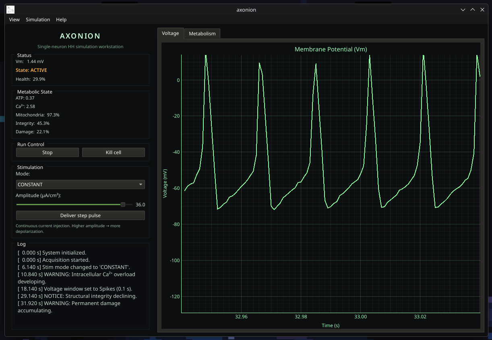

<p align="center">
  
</p>

<br>

## Overview

Axonion is a Python project that implements a simplified model of neuronal electrophysiology based on a Hodgkin–Huxley membrane model extended with a minimal metabolic component.

The project focuses on how electrical activity, calcium dynamics, energy availability, and cellular stress interact over time within a single neuron.

<br>

## Model

The neuron is modeled as a single electrical compartment governed by Hodgkin–Huxley–style ion channel dynamics.  
This electrical core is coupled to a simplified metabolic model that introduces internal state and long-term effects.

> **Key modeled processes include:**
>
> - generation of action potentials  
> - spike-driven accumulation of intracellular Ca²⁺  
> - ATP-dependent calcium clearance and ion pumping  
> - mitochondrial stress and partial recovery  
> - gradual loss of structural integrity and accumulation of permanent damage  

Electrical activity and metabolic state are tightly coupled: a neuron may remain electrically active while internally approaching failure.

<br>

## Interaction and exploration

The model is explored through an interactive interface that allows stimulation, observation, and inspection of internal state in real time.

> **The interface provides:**
>
> - real-time recording of membrane potential  
> - multiple current injection protocols (OFF, CONSTANT, STEP, PULSE)  
> - simulated data acquisition with sampling and noise  
> - live (sliding window) and history (pan/zoom) signal views  
> - visualization of metabolic and structural variables  
> - event logging and basic report generation  

Together, these elements resemble a simplified electrophysiology measurement setup used for exploratory analysis.

<br>

## Interface

<p align="center">
  
</p>

<br>

## Running the project

Axonion requires **Python 3.9 or newer** and a small set of external dependencies.

```bash
pip install -r requirements.txt
python main.py
```

The project runs in standard Python environments
(system Python, virtual environments, or Conda).

<br>

## Scope and limitations

The model implemented in Axonion is intentionally simplified and qualitative.

Its purpose is to provide a coherent system for exploration and interaction, not to reproduce experimental data or serve as a predictive biological model.
